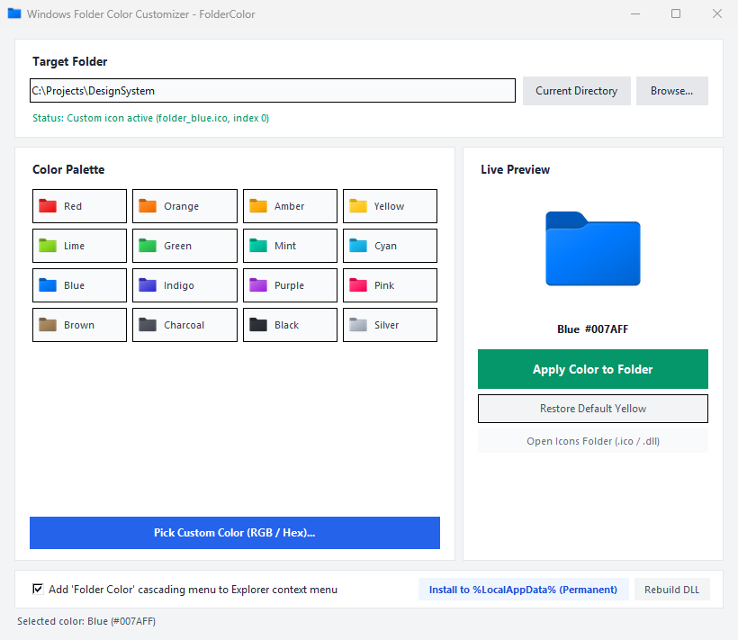

# FolderColor

[English](./README.md) | [繁體中文](./README.zh-TW.md)

A lightweight, native Windows folder customization and coloring tool. It extracts high-resolution Windows folder icons and applies an HLS color fidelity algorithm to transform folder colors while fully preserving official Windows Fluent lighting gradients, top edge highlights, backplate depth, and soft alpha shadows.

<p align="center">
  
</p>

---

## Features

- **HLS Lighting Fidelity**: Unlike crude color overlays, FolderColor decomposes the Windows folder icon into HLS channels to shift hue and saturation while maintaining original luminance curves, gradients, highlights, and translucency.
- **Multi-Resolution Windows Icons**: Pre-generates 7 standard dimensions (16x16, 24x24, 32x32, 48x48, 64x64, 128x128, 256x256) per icon for crisp rendering across all Explorer view modes (Extra Large Icons down to Details list).
- **Native Resource DLL**: Automatically packages all icon variations into a binary Win32 resource DLL (`FolderColors.dll`), allowing you to pick colors inside Windows' native "Change Icon" dialog just like `SHELL32.dll`.
- **Instant Windows Explorer Refresh**: Leverages Win32 Shell APIs (`SHGetSetFolderCustomSettings` and `SHChangeNotify`) to notify Windows Explorer immediately—no restarts or taskbar crashes.
- **Cascading Context Menu**: Integrates a "Folder Color" cascading menu directly into Windows Explorer right-click menus without requiring administrator privileges (written to `HKCU`).
- **Multiple Interfaces**: Use the intuitive Tkinter desktop GUI or the scriptable CLI.

---

## Prerequisites

- **OS**: Windows 10 or Windows 11 (64-bit recommended)
- **Python**: Python 3.8+
- **Python Libraries**:
  ```cmd
  pip install pillow numpy
  ```

---

## Quick Start & Usage

### 1. Desktop GUI (Recommended)

Double-click **`launch_gui.bat`** (or run `python gui.py` in your terminal):

1. Click **Browse...** to select your target folder (or paste a path).
2. Click any color from the **Color Palette** (or click **Pick Custom Color** for arbitrary Hex/RGB).
3. Check the live preview on the right.
4. Click **Apply Color to Folder**. Windows Explorer updates immediately!
5. To revert, click **Restore Default Yellow**.

---

### 2. Windows Explorer Right-Click Context Menu

Change folder colors directly from Windows Explorer with a single click:

- **Enable Context Menu**:
  Check "Add 'Folder Color' cascading menu to Explorer context menu" in the GUI, or run:
  ```cmd
  python cli.py install-menu
  ```
- **How to Use**:
  Right-click any folder (or right-click empty space inside a folder) -> Select **Folder Color** -> Pick any color to apply instantly.
- **Disable Context Menu**:
  ```cmd
  python cli.py uninstall-menu
  ```
  *(Note: All registry keys are written to `HKEY_CURRENT_USER`; no administrator rights needed).*

---

### 3. Command Line Interface (CLI)

Ideal for developer scripting, CI workflows, and terminal users:

```cmd
# Fully install app to %LOCALAPPDATA% and register context menu (Decoupled from repo location)
python cli.py install

# Apply preset color
python cli.py apply "C:\MyProject" red

# Apply custom Hex color
python cli.py apply "C:\MyProject" "#007AFF"

# Restore to default Windows yellow icon
python cli.py reset "C:\MyProject"

# List all available preset color codes
python cli.py list

# Batch generate all multi-resolution ICOs and compile FolderColors.dll
python cli.py build

# Uninstall context menu and optionally purge %LOCALAPPDATA% files
python cli.py uninstall --purge
```

---

### 4. Native Windows "Change Icon" Dialog

If you prefer using the built-in Windows properties window:

1. Right-click any folder -> **Properties**.
2. Switch to the **Customize** tab -> Click **Change Icon...**.
3. Under "Look for icons in this file", click **Browse...**:
   - **Option A (All Colors in One)**: Select **`FolderColors.dll`** from this repository. A grid of all colored folder icons appears just like `SHELL32.dll`.
   - **Option B (Individual ICO)**: Navigate to the **`icons/`** directory and choose any `.ico` file directly.
4. Click **OK** -> **Apply**.

---

## Recommended Persistent Path (`%LOCALAPPDATA%\FolderColor`)

When Windows assigns a custom icon to a folder, it creates a hidden `desktop.ini` pointing to the icon's absolute file path. If you later relocate or delete this project repository, Windows will revert those folders to the default yellow icon because the DLL path is broken.

**Solution**: Install the icon library to your persistent local app directory:
```cmd
python cli.py install-lib
```
Or click **Install to %LocalAppData% (Permanent)** in the GUI.

**Benefits**:
- **Fixed Location**: Saved to `%LOCALAPPDATA%\FolderColor`, remaining valid even if the Git workspace is moved.
- **No Admin Required**: Fully accessible under standard user permissions.
- **Environment Variable Support**: In the Windows icon dialog, you can directly enter `%LOCALAPPDATA%\FolderColor\FolderColors.dll`.

---

## Built-in Presets

| Key | Name | Hex Code | Icon File |
| :--- | :--- | :--- | :--- |
| `red` | Red | `#EB3C3C` | `icons/folder_red.ico` |
| `orange` | Orange | `#F58220` | `icons/folder_orange.ico` |
| `amber` | Amber | `#FFAF14` | `icons/folder_amber.ico` |
| `yellow` | Yellow (Default) | `#FFCD32` | `icons/folder_yellow.ico` |
| `lime` | Lime | `#8CD728` | `icons/folder_lime.ico` |
| `green` | Green | `#34C759` | `icons/folder_green.ico` |
| `mint` | Mint | `#00C3A0` | `icons/folder_mint.ico` |
| `cyan` | Cyan | `#1EB4E6` | `icons/folder_cyan.ico` |
| `blue` | Blue | `#007AFF` | `icons/folder_blue.ico` |
| `indigo` | Indigo | `#5856D6` | `icons/folder_indigo.ico` |
| `purple` | Purple | `#AF52DE` | `icons/folder_purple.ico` |
| `pink` | Pink | `#FF2D73` | `icons/folder_pink.ico` |
| `brown` | Brown | `#A2845E` | `icons/folder_brown.ico` |
| `charcoal` | Charcoal | `#50555F` | `icons/folder_charcoal.ico` |
| `black` | Black | `#2D3037` | `icons/folder_black.ico` |
| `silver` | Silver | `#B9BEC8` | `icons/folder_silver.ico` |

---

## Project Structure

```
FolderColor/
│
├── core.py                   # Core engine: icon extraction, HLS recoloring, ICO/DLL compilation, Shell APIs
├── gui.py                    # Modern desktop GUI (Tkinter with High-DPI support)
├── cli.py                    # Terminal command-line interface
├── context_menu.py           # Explorer right-click cascading menu registry manager
├── launch_gui.bat            # Silent desktop launcher
├── FolderColors.dll          # Compiled Win32 DLL containing 16 icon resources
├── base_folder.png           # 256x256 Windows base folder template cache
├── icons/                    # Directory containing all multi-size .ico files (16px - 256px)
├── assets/                   # Screenshots and graphical assets
├── README.md                 # English documentation
└── README.zh-TW.md           # Traditional Chinese documentation
```

---

## License

This project is open-source and available under the [MIT License](LICENSE).
